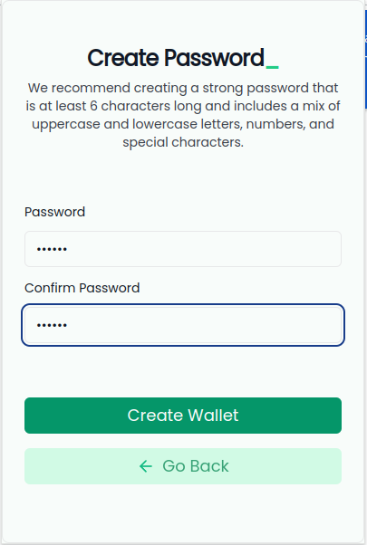
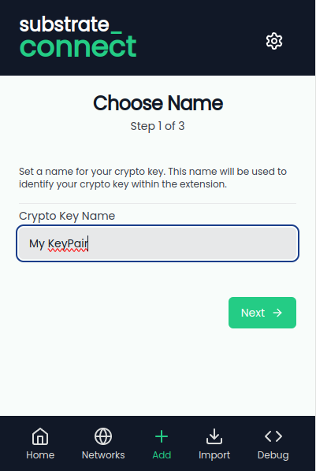
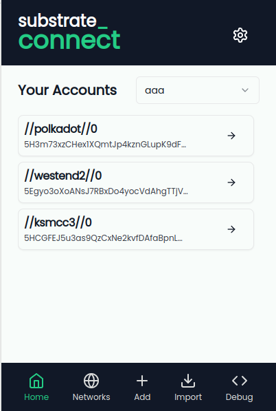
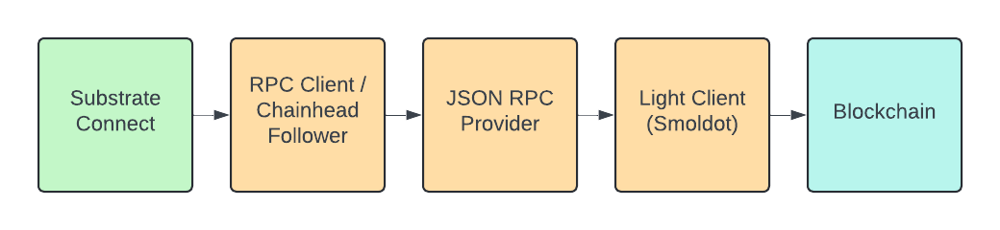

# Substrate Connect - Light Client Wallet Template

## Overview

Welcome to Substrate Connect - the ultimate light client wallet template! Substrate Connect leverages the power of [smoldot](https://github.com/smol-dot/smoldot), a light client that implements the JSON RPC Spec to provide a highly resilient, efficient, and user-friendly wallet experience. By using this template, your extension will be able to instantly connect any dapp to any  Substrate-based chains without the hassle of waiting for synchronization.

## Getting Started

### Prerequisites

- **Corepack** - [Zero runtime dependency manager](https://github.com/nodejs/corepack)

### Installation

Clone the repository and install dependencies:

```bash
corepack pnpm i
corepack pnpm turbo build
```

### Running the Wallet

Start the development server:

```bash
corepack pnpm dev
```

In another terminal:

```bash
corepack pnpm start
```

This will open the extension in a browser window.

## Usage

### As a Wallet

1. Launch the extension and create a password



2. Click "Add" and create your first crypto key



3. You now have access to your accounts. Each account is linked to a specific 
   derivation path for each consensus system.



### As a Dapp

As a dapp, you will want to use the 
[@substrate/discovery](../../packages/discovery/README.md) protocol to discover 
the extension. An example implementation can be found in the 
[light client dapp](../../examples/light-client-dapp/) folder.

### As an Extension

You will want to utilize the 
[@substrate/light-client-extension-helpers](../../packages/light-client-extension-helpers/README.md) 
package to easily add light client functionality to your extension. See 
the documentation there for more details.

## How it Works



Substrate Connect runs a single smoldot instance inside of the user's browser. 
When a dapp connects to Substrate Connect, its connection to the blockchain is 
forwarded to that smoldot instance. Inside the extension, we use low level 
[polkadot-api](https://github.com/polkadot-api/polkadot-api) libraries such as 
the `observable-client`, `substrate-client`, and `json-rpc-provider` to 
maintain a connection to smoldot.

If smoldot were to crash, Substrate Connect will automatically re-connect with 
a new `addChain` call. However, from the dapp perspective, you will be 
disconnected and it will be your responsibility to re-connect back to Substrate 
Connect.

## Step by Step Guide

Follow the [Step by Step Guide](./STEP-BY-STEP-GUIDE.md)for details on how to 
add light client support to your extension. This guide explains how to 
integrate smoldot and the light client extension helpers into your browser 
extension

### Giving Feedback

If you have trouble integrating this wallet template or you have questions, 
please open an issue.

## Acknowledgments

- [Substrate](https://docs.substrate.io/) - The blockchain framework that 
  powers this template.
- [Smoldot](https://github.com/smol-dot/smoldot) - The light client used for 
  connecting to blockchains.
- [Polkadot Provider API Forum Post](https://forum.polkadot.network/t/polkadot-provider-api-a-common-interface-for-building-decentralized-applications/4128) 
  - For providing a common interface for building decentralized applications.
