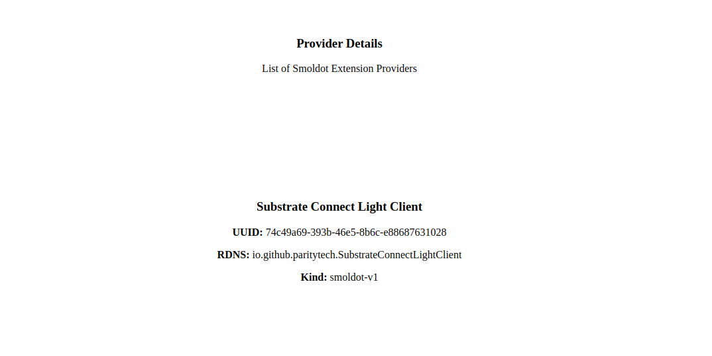
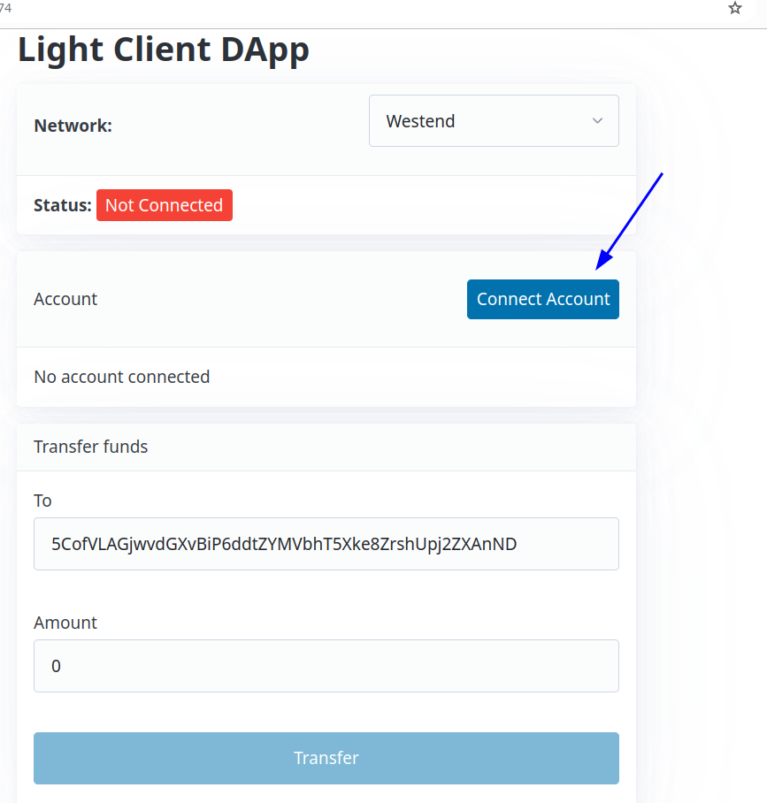
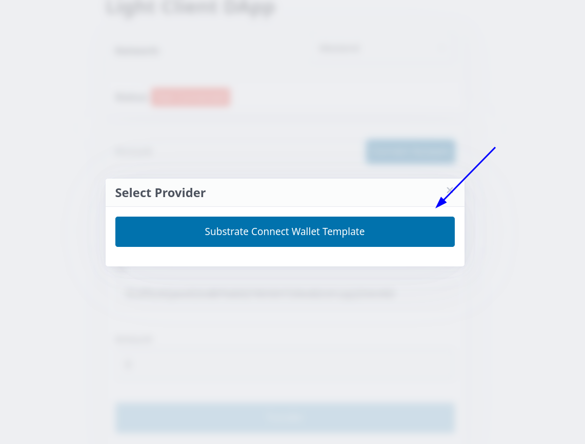
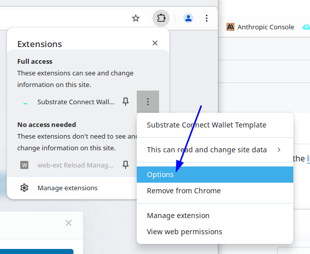
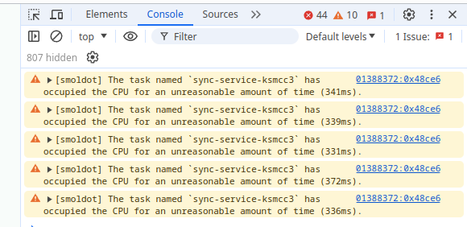

# Step by Step Guide

To add light client functionality to your extension, follow this step-by-step
guide. This guide explains how to integrate smoldot and the light client
extension helpers into your browser extension.

## Requirements

- Manifest V3: This is required in both Chrome and Firefox because we need to use service workers to run [smoldot](https://github.com/smol-dot/smoldot). For more details, you can refer to the [Chrome Manifest V3 documentation](https://developer.chrome.com/docs/extensions/mv3/intro/) and the [Firefox Manifest V3 documentation](https://developer.mozilla.org/en-US/docs/Mozilla/Add-ons/WebExtensions/manifest.json/background).
- Ensure the following permissions are enabled in your manifest: `["notifications", "storage", "tabs", "alarms"]`.

## Setup

First install these three packages: `@substrate/light-client-extension-helpers`, @substrate/smoldot-discovery and `@substrate/connect-known-chains`. We will use these packages to implement a provider for the `@substrate/smoldot-discovery` package.

```sh
pnpm i @substrate/light-client-extension-helpers @substrate/connect-known-chains @substrate/smoldot-discovery
```

## @substrate/smoldot-discovery Integration

### 1. Add Light Client Background Extension Helper

Start by adding the light client background extension helper to your background script. This must be a service worker script using Manifest V3. When your extension launches, it will immediately connect to `smoldot`.

**Manifest V3 Configuration:**

```json
// manifest-v3-chrome.json
"background": {
  "service_worker": "background/background.js",
  "type": "module"
},
```

**Background Script:**

```ts
import {
  polkadot,
  ksmcc3,
  westend2,
  paseo,
} from "@substrate/connect-known-chains"
import { start } from "@substrate/light-client-extension-helpers/smoldot"

const { lightClientPageHelper, addOnAddChainByUserListener } = register({
  smoldotClient: start({ maxLogLevel: 4 }),
  getWellKnownChainSpecs: async () => [polkadot, ksmcc3, westend2, paseo],
})
```

### 2. Register Content Script

Then, invoke the register function in your content script and inject your in-page into the DOM. See the [content script](./content/index.ts) for detailed implementation.

**Content Script:**

```ts
import { register } from "@substrate/light-client-extension-helpers/content-script"

const CHANNEL_ID = "substrate-wallet-template"

try {
  const s = document.createElement("script")
  s.src = chrome.runtime.getURL("inpage/inpage.js")
  s.onload = () => s.remove()
  ;(document.head || document.documentElement).appendChild(s)
} catch (error) {
  console.error("error injecting inpage/inpage.js", error)
}

register(CHANNEL_ID)

const port = chrome.runtime.connect({ name: "substrate-wallet-template" })
port.onMessage.addListener((msg) =>
  window.postMessage({ origin: "substrate-wallet-template/extension", msg }),
)
window.addEventListener("message", ({ data }) => {
  if (data.origin !== "substrate-wallet-template/web") return
  port.postMessage(data.msg)
})
```

### 3. Inject In-Page Script

Finally, in the in-page script injected by the content script, expose your provider using the `@substrate/discovery` protocol in conjunction with the `@substrate/smoldot-discovery` package. Refer to the [in-page script](./src/inpage/index.ts) for full implementation details.

**In-Page Script:**

```ts
import { getLightClientProvider } from "@substrate/light-client-extension-helpers/web-page"
import type { SmoldotExtensionProviderDetail } from "@substrate/smoldot-discovery/types"
import { connector as smoldotDiscoveryConnector } from "@substrate/smoldot-discovery"

const CHANNEL_ID = "substrate-wallet-template"

const PROVIDER_INFO = {
  uuid: crypto.randomUUID(),
  name: "Substrate Connect Wallet Template",
  icon: "data:image/svg+xml,<svg xmlns='http://www.w3.org/2000/svg'/>",
  rdns: "io.github.paritytech.SubstrateConnectWalletTemplate",
}

const lightClientProvider = getLightClientProvider(DOM_ELEMENT_ID)

// #region Smoldot Discovery Provider
{
  const provider = lightClientProviderPromise.then((provider) =>
    connector.make({ lightClientProvider: provider }),
  )

  const detail: SmoldotExtensionProviderDetail = Object.freeze({
    info: PROVIDER_INFO,
    kind: "smoldot-v1",
    provider,
  })

  window.addEventListener(
    "substrateDiscovery:requestProvider",
    ({ detail: { onProvider } }) => onProvider(detail),
  )

  window.dispatchEvent(
    new CustomEvent("substrateDiscovery:announceProvider", {
      detail,
    }),
  )
}
// #endregion
```

### 4. Verify integration

To verify your integration, build your extension and load it into your browser. Then, run the [@substrate/smoldot example](../../examples/smoldot-discovery-example).

If you see your extension in the list, you have completed this integration.



---

## @substrate/connect-discovery Integration

The next part of this tutorial will extend the steps of the prior integration. It adds support for the @substrate/connect-discovery package. We will use Polkadot JS (PJS) extension as a baseline in this example.

### 1. Install Additional Packages

```sh
pnpm i @polkadot-api/pjs-signer @polkadot-api/utils @substrate/connect-discovery
```

### 2. Implement the @substrate/connect-discovry protocol

Use the following code below to implement `createTx` and `getAccounts`. Replace "polkadot-js" with the name of your PJS-compatible extension.

```ts
// #region Connect Discovery Provider
{
  const provider = lightClientProviderPromise.then(
    (lightClientProvider): Unstable.Provider => ({
      ...lightClientProvider,
      async createTx(chainId: string, from: string, callData: string) {
        const chains = Object.values(lightClientProvider.getChains())
        const chain = chains.find(({ genesisHash }) => genesisHash === chainId)

        if (!chain) {
          throw new Error("unknown chain")
        }

        const injectedExt = await connectInjectedExtension("polkadot-js")

        const account = injectedExt
          .getAccounts()
          .find((account) => toHex(account.polkadotSigner.publicKey) === from)

        if (!account) {
          throw new Error("no account")
        }

        const signer = account.polkadotSigner

        const tx = await createTx(chain.connect)({
          callData: fromHex(callData),
          signer,
        })

        return toHex(tx)
      },
      async getAccounts(_chainId: string) {
        const injectedExt = await connectInjectedExtension("polkadot-js")
        const accounts = injectedExt.getAccounts()

        return accounts
      },
    }),
  )

  const detail: Unstable.SubstrateConnectProviderDetail = Object.freeze({
    info: PROVIDER_INFO,
    kind: "substrate-connect-unstable",
    provider,
  })

  window.addEventListener(
    "substrateDiscovery:requestProvider",
    ({ detail: { onProvider } }) => onProvider(detail),
  )

  window.dispatchEvent(
    new CustomEvent("substrateDiscovery:announceProvider", {
      detail,
    }),
  )
}
// #endregion
```

### 3. Verify Integration

Once your extension is properly set up, you can test it using the [light client dapp example](../../examples/light-client-dapp).

1. **Connect Account**:

   - Click on "Connect Account" in the dapp.
   - 

2. **Verify Extension in Providers List**:

   - Ensure your extension is listed among the available providers.
   - 

3. **Access Extension Options**:

   - Open the options page within your extension.
   - 

4. **Check Smoldot Logs**:
   - In your extension console (not the webpage console), verify that smoldot logs are being printed.
   - 

If you successfully complete these steps, your extension setup is finalized.
